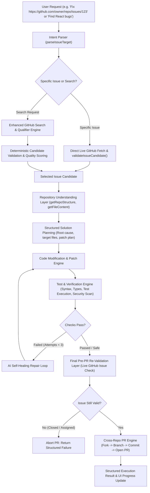

# MergeMate 🚀 Autonomous GitHub Coding Agent

**MergeMate** is an end-to-end autonomous software-engineering AI agent built with **Next.js 14 (App Router)**, **TypeScript**, **Tailwind CSS**, **Google Gemini API**, and **GitHub Octokit REST API**.

Given a natural language instruction or specific GitHub issue URL, MergeMate independently explores the target repository, formulates a structured engineering plan, implements the code patch, executes an automated test/repair loop, verifies security rules, and submits verified cross-repository Pull Requests directly to GitHub.

---

## 🌟 Key Capabilities

### 1. General-Purpose Intent & Target Resolution
- **Direct Issue URL Resolution:** Paste any GitHub issue URL (`https://github.com/owner/repo/issues/123`) or shorthand `owner/repo#123` to bypass broad search and immediately target that issue.
- **Generalized Discovery:** Search issues across technologies (**React**, **TypeScript**, **Node.js**, **MongoDB**), difficulty tiers (`beginner`, `intermediate`, `advanced`), or issue types (`bug`, `feature`, `documentation`, `test`).
- **Flexible Execution Modes:** Supports `analyze` (investigate & plan only), `fix` (implement & verify without PR), and `autonomous` (full lifecycle including PR submission).

### 2. Deterministic Multi-Layer Issue Validation (GitHub as Source of Truth)
- **Live State Verification:** Directly validates that the issue exists, is `open`, and is NOT a Pull Request disguised as an issue.
- **Assignee Rejection:** Discards issues already assigned to human contributors to avoid conflict.
- **Competing PR Detection:** Scans repository timeline and cross-referenced PRs (`type:pr is:open repo:... #<id>`) to detect if active work is already in progress.
- **Candidate Quality & Solvability Scoring:** Scores issues (0–100) and classifies estimated solvability based on description clarity, code blocks, and recency.

### 3. Progressive Repository Understanding Layer
- `getRepoStructure`: Explores directory tree, `package.json` dependencies, and detected test frameworks (`jest`, `vitest`, `mocha`).
- `getFileContent`: Targeted retrieval of source files.
- `searchCodeInRepo`: Semantic & symbol search across repository files.

### 4. Structured Engineering Plans & Self-Healing Repair Loop
- Produces internal engineering plans (issue understanding, root cause hypothesis, target files, patch strategy, test strategy, risk analysis).
- Runs a bounded **Test & Repair Loop** (`MAX_REPAIR_ATTEMPTS = 3`):
  1. Validates syntax and type contracts.
  2. Runs test assertions.
  3. Scans for security risks and leaked credentials (`scanDiffForSecurityRisks`).
  4. Automatically refines patch if issues are detected.

### 5. Final Pre-PR Security & GitHub Re-Validation
- Re-checks issue status immediately before branch creation to protect against race conditions (e.g. issue closed by maintainer during analysis).
- Security scanner ensures NO API keys, tokens, or `.env` files are committed.

### 6. Robust Gemini Key Rotator (`lib/geminiRotator.ts`)
- Manages a pool of Gemini API keys (`GEMINI_KEY_1..5`, `GEMINI_API_KEY`).
- Automatically intercepts HTTP 429 Rate Limit responses and rotates keys seamlessly.

---

## 🏗️ State Machine Architecture



---

## 🚀 Getting Started

### 1. Prerequisites
- **Node.js** v18+ installed
- At least one **Google Gemini API Key** (from Google AI Studio)
- (Optional) **GitHub Personal Access Token** with `repo` or `public_repo` scope

### 2. Installation

```bash
git clone <repo-url>
cd "Git Request"
npm install
```

### 3. Environment Configuration

Copy `.env.example` to `.env`:

```bash
cp .env.example .env
```

Fill in your credentials:

```env
# GitHub Personal Access Token (for live Fork & PR workflow)
GITHUB_TOKEN=ghp_your_github_token_here

# Gemini API Keys Pool for Key Rotator
GEMINI_KEY_1=AIzaSy_your_first_gemini_key
GEMINI_KEY_2=AIzaSy_your_second_gemini_key
GEMINI_KEY_3=AIzaSy_your_third_gemini_key
```

*Note: You can also dynamically configure keys in the UI via the "API Keys" drawer.*

### 4. Running the Dev Server

```bash
npm run dev
```

Open [http://localhost:3000](http://localhost:3000) (or [http://localhost:3001](http://localhost:3001) if port 3000 is occupied).

---

## 🧪 Automated Testing & Verification

MergeMate includes a comprehensive automated test suite:

### 1. Autonomous Agent Test Suite (`npm run test:agent`)
Tests URL parsing, security scanners, solvability scoring, direct issue validation, bounded test/repair loops, and full state machine execution:

```bash
npm run test:agent
```

### 2. Deterministic Validation Test Suite (`npm run test:validation`)
Tests all 10 GitHub issue validation edge cases (closed issues, PRs in search, assignees, competing active PRs, archived repos, pre-PR aborts):

```bash
npm run test:validation
```

### 3. End-to-End Workflow Verifier (`npm run test:e2e`)
Runs the live autonomous pipeline against real or simulated GitHub data:

```bash
npm run test:e2e
```

### 4. Production Build (`npm run build`)
Verifies TypeScript typing, page generation, and bundle compilation:

```bash
npm run build
```

---

## 🛡️ Security & Privacy
- **Token Isolation:** User GitHub tokens and environment secrets are never forwarded to Gemini prompts.
- **Diff Security Scanner:** Every generated code diff is scanned for API keys, private keys, `.env` file references, and sensitive tokens prior to branch creation.
- **Safe Branching:** All write actions use cross-repository forks and dedicated feature branches (`mergemate/fix-<id>-<slug>`).

---

## 📜 License
MIT License. Built for autonomous open-source software engineering.
